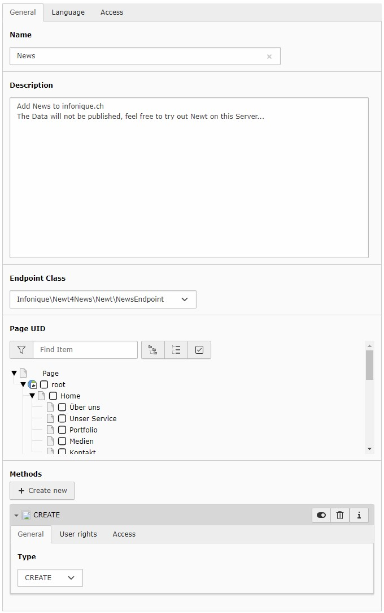
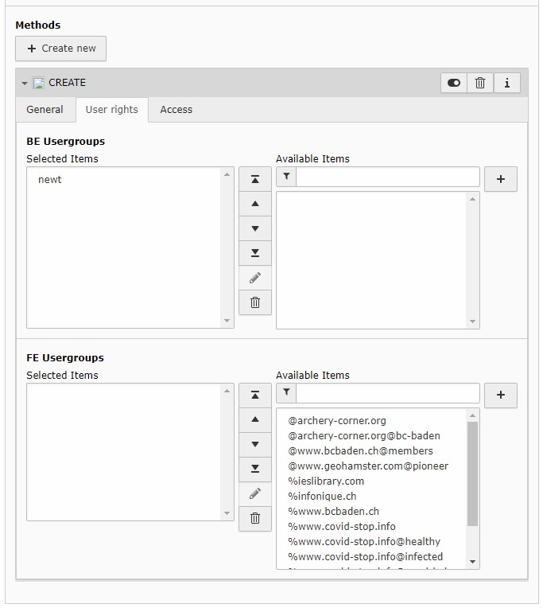

.. include:: ../Includes.txt

.. _addendpoints:

================
Add the Endpoint
================

To add the endpoint, switch into list-view, chose the storage-page (see plugin.tx_newt.persistence.storagePid)

Click the plus-button, to add a new record and chose "Endpoint" under "Newt"

Enter the Name and the description, the Client will see this labels.

Chose the Endpoint Class Infonique\\Newt4News\\Newt\\NewsEndpoint from the list

If you fill in the Page UID, the records created with Newt will be stored on this page.

Add at least one Method

Admin-Users will see all endpoints, all other users have to be granted by BE-Groups
There is also a frontend-plugin available, if you like to grant the access to Newt for any FE-Users, you may add a FE-Group as well

When this record is saved, the endpoint is configured, and the client is able to read the configuration of this endpoint
and is able to create new records as you defined in the endpoint.
