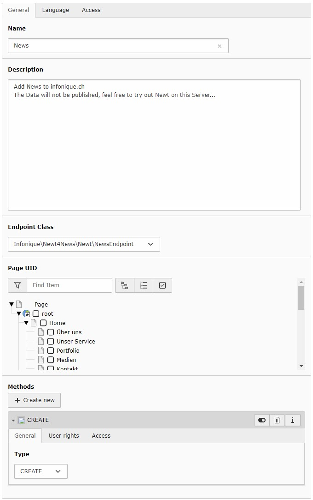

.. include:: ../Includes.txt

.. _configuration:

=============
Configuration
=============

To configurate this extension, you have to add the static template of Newt4News

After adding the static, you will find the constants in the Constant editor:

======================================  ==========  ==================================================================  =======================================
Property:                               Data type:  Description:                                                        Default:
======================================  ==========  ==================================================================  =======================================
settings.istopnews.active               boolean     Activates the istopnews in the Endpoint                             1
--------------------------------------  ----------  ------------------------------------------------------------------  ---------------------------------------
settings.title.active                   boolean     Activates the title in the Endpoint                                 1
settings.title.required                 boolean     Sets the title required                                             1
--------------------------------------  ----------  ------------------------------------------------------------------  ---------------------------------------
settings.teaser.active                  boolean     Activates the teaser in the Endpoint                                1
settings.teaser.required                boolean     Sets the teaser required                                            
--------------------------------------  ----------  ------------------------------------------------------------------  ---------------------------------------
settings.bodytext.active                boolean     Activates the bodytext in the Endpoint                              1
settings.bodytext.required              boolean     Sets the bodytext required                                          
--------------------------------------  ----------  ------------------------------------------------------------------  ---------------------------------------
settings.datetime.active                boolean     Activates the datetime in the Endpoint                              1
settings.datetime.required              boolean     Sets the datetime required                                          
--------------------------------------  ----------  ------------------------------------------------------------------  ---------------------------------------
settings.archive.active                 boolean     Activates the archive in the Endpoint                               1
settings.archive.required               boolean     Sets the archive required                                           
--------------------------------------  ----------  ------------------------------------------------------------------  ---------------------------------------
settings.image.active                   boolean     Activates the image in the Endpoint                                 1
settings.image.required                 boolean     Sets the image required                                             
--------------------------------------  ----------  ------------------------------------------------------------------  ---------------------------------------
settings.imagealt.active                boolean     Activates the imagealt in the Endpoint                              1
settings.imagealt.required              boolean     Sets the imagealt required                                          
--------------------------------------  ----------  ------------------------------------------------------------------  ---------------------------------------
settings.imagedesc.active               boolean     Activates the imagedesc in the Endpoint                             1
settings.imagedesc.required             boolean     Sets the imagedesc required                                         
--------------------------------------  ----------  ------------------------------------------------------------------  ---------------------------------------
settings.relatedfile.active             boolean     Activates the relatedfile in the Endpoint                           1
settings.relatedfile.required           boolean     Sets the relatedfile required                                       
--------------------------------------  ----------  ------------------------------------------------------------------  ---------------------------------------
settings.categories.active              boolean     Activates the categories in the Endpoint                            1
settings.categories.required            boolean     Sets the categories required                                        
======================================  ==========  ==================================================================  =======================================

[tsref:plugin.tx_newt4news]

================
Add the Endpoint
================

To add the endpoint, switch into list-view, chose the storage-page (see plugin.tx_newt.persistence.storagePid)

Click the plus-button, to add a new record and chose "Endpoint" under "Newt"

Enter the Name and the description, the Client will see this labels.

Chose the Endpoint Class Infonique\\Newt4News\\Newt\\NewsEndpoint from the list

If you fill in the Page UID, the records created with Newt will be stored on this page.

Add at least one Method

Admin-Users will see all endpoints, all other users have to be granted by BE-Groups
There is also a frontend-plugin available, if you like to grant the access to Newt for any FE-Users, you may add a FE-Group as well

.. figure:: ../Images/backend-03.jpg
    :class: with-shadow
    :alt: Grant access with groups

When this record is saved, the endpoint is configured, and the client is able to read the configuration of this endpoint
and is able to create new records as you defined in the endpoint.

