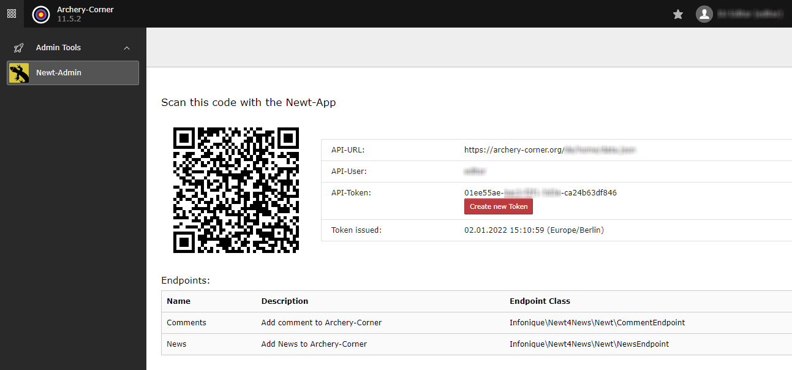

.. include:: ../Includes.txt

.. _introduction:

============
Introduction
============

.. _what-it-does:

What does it do?
================

The plugin adds a new Endpoint to Newt based on the news-Extension from Georg Ringer.

Newt is a mobile-app available for free to manage Data on any server (not only TYPO3)

With this extension you are able to create Endpoints for the app and grant the access to your backend-users individually

The main goal is to insert news without login into TYPO3

.. _screenshots:

Screenshots
===========

